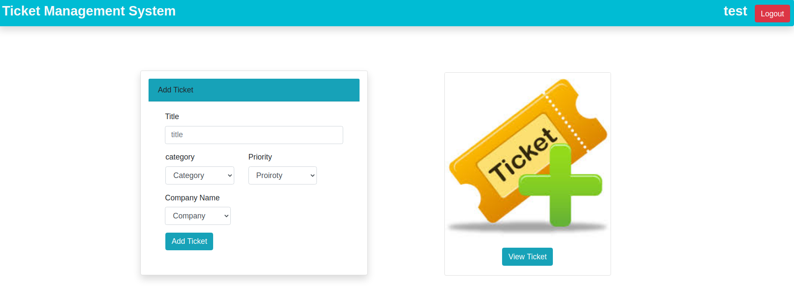
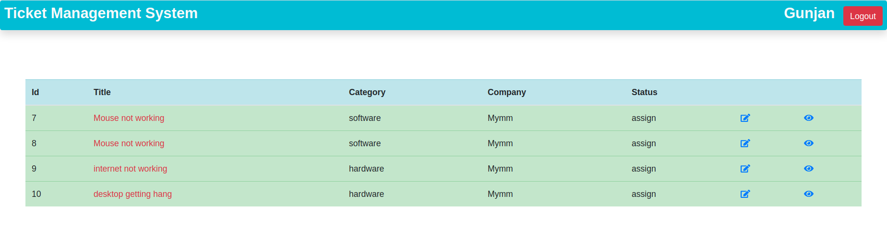
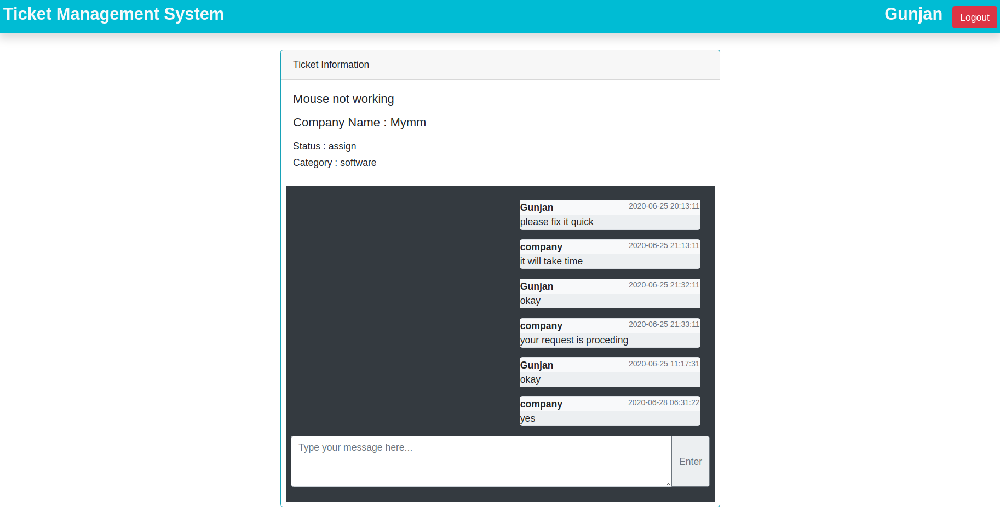
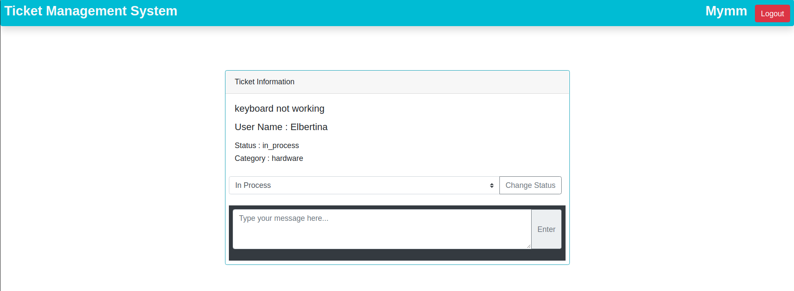

This project was bootstrapped with [Create React App](https://github.com/facebook/create-react-app).

## Project Name: Ticket Management

### Description
The Ticket management system is used to raise a ticket in perticular organization.
The organization is also able to handle the raised tickets.

<a href =  "http://ticket.gunjan.tech/">
  <button style = "background:red,padding:5px">Demo Link</button>
</a>
<li>To login on user or company use: email = test@gmail.com , password = test</li>

To know better about project ,some images of project are shown below:
<li>Home page of user in which user can add or view tickets.</li>

<li>User can see their raised tickets.</li>

<li>User can chat with the organization.</li>

<li>Company can change the status of the ticket.</li>

### Getting Started

<li>steps to start this application from frontend</li>

1) Clone the repo to your home directory.

2) npm install

3) npm start

<li>steps to start this application from Flask</li>
1) set up the virtual env
    python3 -m venv venv

2) Activate virtual env
    . venv/bin/activate

3) pip install -r requirement.txt

4) export FLASK_APP=server.py

5) flask run
